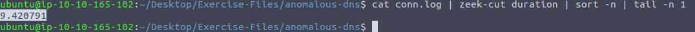
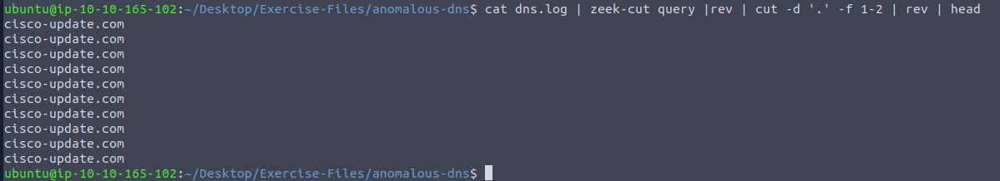

# Zeek Exercises

## Task 2: Anomalous DNS

### 1. Investigate the dns-tunneling.pcap file. Investigate the dns.log file. What is the number of DNS records linked to the IPv6 address?

Firstly, cd to the anomalous-dns directory in the Exercise-Files folder
```bash
cd Desktop/Exercise-Files/anomalous-dns
```

Investigate the dns-tunneling.pcap file with zeek
```bash
zeek -C -r dns-tunneling.pcap
```

The log files should have generated after zeek is run on the pcap file. Now to investigate the number of DNS records linked to the IPV6 address we need to look for the number of time "AAAA" appears under the column "qtype_name" i.e. DNS "AAAA" records store IPV6 addresses.
```bash
cat dns.log | zeek-cut qtype_name | sort | uniq -c
```
This outputs the below:


#### Answer: 320

### 2. Investigate the conn.log file. What is the longest connection duration?

We have to check the duration column in the conn.log file to find the longest connection duration. To do this, we run the following command which extracts the duration column, sorts the numbers in asceding order and extracts the last value (highest value) in the list:
```bash
cat conn.log | zeek-cut duration | sort -n | tail -n 1
```
The output is the below:


#### Answer: 9.420791

### 3. Investigate the dns.log file. Filter all unique DNS queries. What is the number of unique domain queries?

First, we run the command given in the hint of this step to get an idea of the domain queries we are looking for.
```bash
cat dns.log | zeek-cut query |rev | cut -d '.' -f 1-2 | rev | head
```
This outputs:


The command is filtering for the top-level and second-level domains.

Now that we have an idea of what we are looking we would add in the above command to sort the output alphabetically, remove duplicates, and finally count the number of unique domain names.
```bash
cat dns.log | zeek-cut query |rev | cut -d '.' -f 1-2 | rev | sort |uniq | wc -l
```

#### Answer: 6

### 4. There are a massive amount of DNS queries sent to the same domain. This is abnormal. Let's find out which hosts are involved in this activity. Investigate the conn.log file. What is the IP address of the source host?

To find the source IP address, we simply look at the id.orig_h column in the conn.log file
```bash
cat conn.log | zeek-cut id.orig_h | uniq -c
```
This outputs:

