# Zeek Exercises

## Task 2: Anomalous DNS

### 1. Investigate the dns-tunneling.pcap file. Investigate the dns.log file. What is the number of DNS records linked to the IPv6 address?

Firstly, cd to the anomalous-dns directory in the Exercise-Files folder
```bash
cd Desktop/Exercise-Files/anomalous-dns
```

Investigate the dns-tunneling.pcap file with zeek
```bash
zeek -C -r dns-tunneling.pcap
```

The log files should have generated after zeek is run on the pcap file. Now to investigate the number of DNS records linked to the IPV6 address we need to look for the number of time "AAAA" appears under the column "qtype_name" i.e. DNS "AAAA" records store IPV6 addresses.
```bash
cat dns.log | zeek-cut qtype_name | sort | uniq -c
```
This outputs the below:
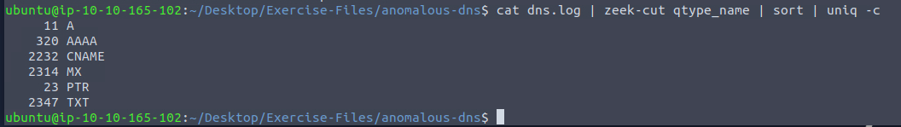

#### Answer: 320

### 2. Investigate the conn.log file. What is the longest connection duration?

We have to check the duration column in the conn.log file to find the longest connection duration. To do this, we run the following command which extracts the duration column, sorts the numbers in asceding order and extracts the last value (highest value) in the list:
```bash
cat conn.log | zeek-cut duration | sort -n | tail -n 1
```
The output is the below:
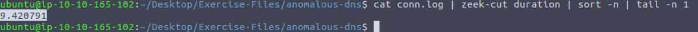

#### Answer: 9.420791

### 3. Investigate the dns.log file. Filter all unique DNS queries. What is the number of unique domain queries?

First, we run the command given in the hint of this step to get an idea of the domain queries we are looking for.
```bash
cat dns.log | zeek-cut query |rev | cut -d '.' -f 1-2 | rev | head
```
This outputs:

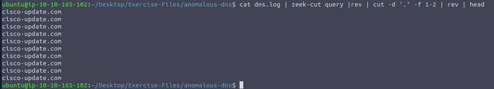
The command is filtering for the top-level and second-level domains.

Now that we have an idea of what we are looking we would add in the above command to sort the output alphabetically, remove duplicates, and finally count the number of unique domain names.
```bash
cat dns.log | zeek-cut query |rev | cut -d '.' -f 1-2 | rev | sort |uniq | wc -l
```

#### Answer: 6

### 4. There are a massive amount of DNS queries sent to the same domain. This is abnormal. Let's find out which hosts are involved in this activity. Investigate the conn.log file. What is the IP address of the source host?

To find the source IP address, we simply look at the id.orig_h column in the conn.log file
```bash
cat conn.log | zeek-cut id.orig_h | uniq -c
```
This outputs:
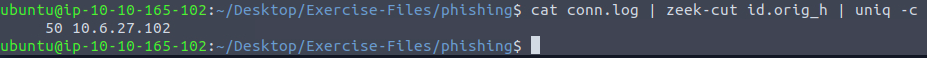


## Task 3: Phishing

### 1. Investigate the logs. What is the suspicious source address? Enter your answer in defanged format.

Firstly, cd to the phishing directory in the Exercise-Files folder
```bash
cd Desktop/Exercise-Files/phishing
```

Investigate the phishing.pcap file with zeek
```bash
zeek -C -r phishing.pcap
```

Investigate the conn.log file for the suspicious source address
```bash
cat conn.log | zeek-cut id.orig_h | uniq -c
```
This outputs the below:


Navigate to the CyberChef website and use the recipe 'Defang IP address' to defang the IP address:
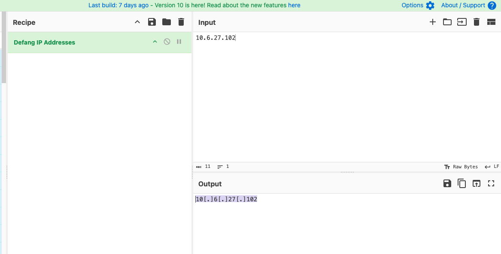

#### Answer: 10[.]6[.]27[.]102

### 2. Investigate the http.log file. Which domain address were the malicious files downloaded from? Enter your answer in defanged format.

Run the following command to investigate the host and URI where the malicious files are downloaded from:
```bash
cat http.log | zeek-cut uri host
```
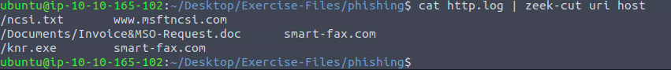

Navigate to the CyberChef website and use the recipe 'Defang URL' to defang the url:
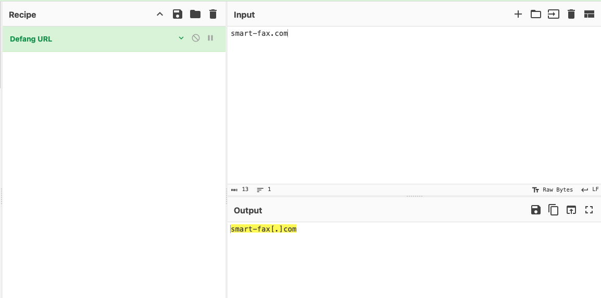

#### Answer: smart-fax[.]com

### 3. Investigate the malicious document in VirusTotal. What kind of file is associated with the malicious document?

Run the phishing.pcap file against the hash-demo.zeek script to obtain the hash values of the files.
```bash
zeek -C -r phishing.pcap hash-demo.zeek
```

Investigate the files.log to find the hash values of the file.
```bash
cat files.log | zeek-cut mime_tpe md5
```

Copy the md5 hash of the file with mime type of application/msword and paste the value in the VirusTotal website.
Under the 'Relations' tab, scroll down to the Bundled Files table for the file type of the malicious document.
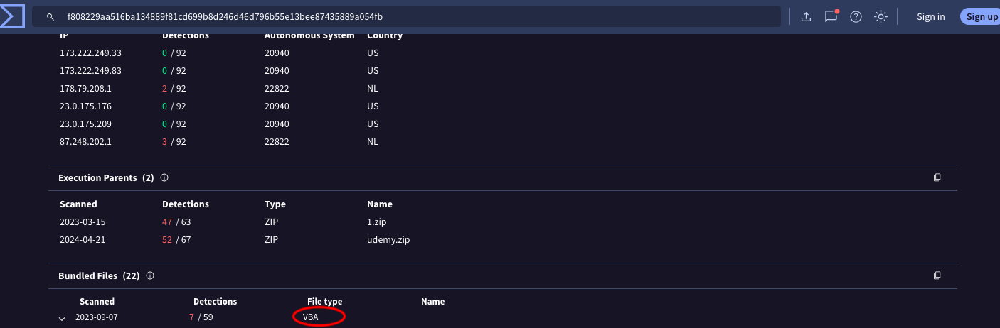

#### Answer: VBA

### 4. Investigate the extracted malicious .exe file. What is the given file name in Virustotal?

Investigate the files.log to find the hash values of the file.
```bash
cat files.log | zeek-cut mime_tpe md5
```

Copy the md5 hash of the file with mime type of application/x-dosexec (this is the md5 hash of the .exe file) and paste the value in the VirusTotal website.
The file name is listed in the VirusTotal output:
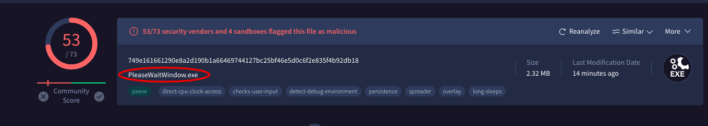

#### Answer: PleaseWaitWindow.exe

### 5. Investigate the malicious .exe file in VirusTotal. What is the contacted domain name? Enter your answer in defanged format.

Following from question 4, navigate to the "Behavior tab" in VirusTotal website. Under DNS Resolutions you would find the contacted domain name:
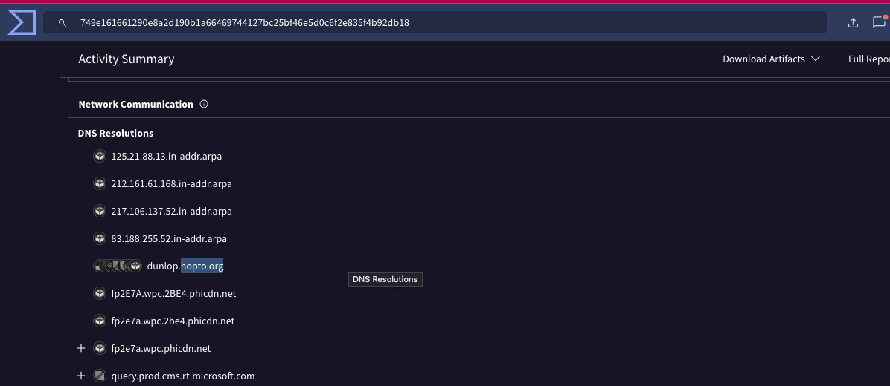

Navigate to the CyberChef webite and under the "Defang URL" recipe, paste the domain name:
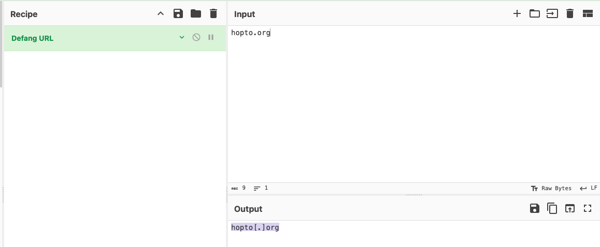

#### Answer: hopto[.]org

### 6. Investigate the http.log file. What is the request name of the downloaded malicious .exe file?

Run the following command to investigate the host and URI where the malicious files are downloaded from:
```bash
cat http.log | zeek-cut uri host
```


#### Answer: knr.exe
